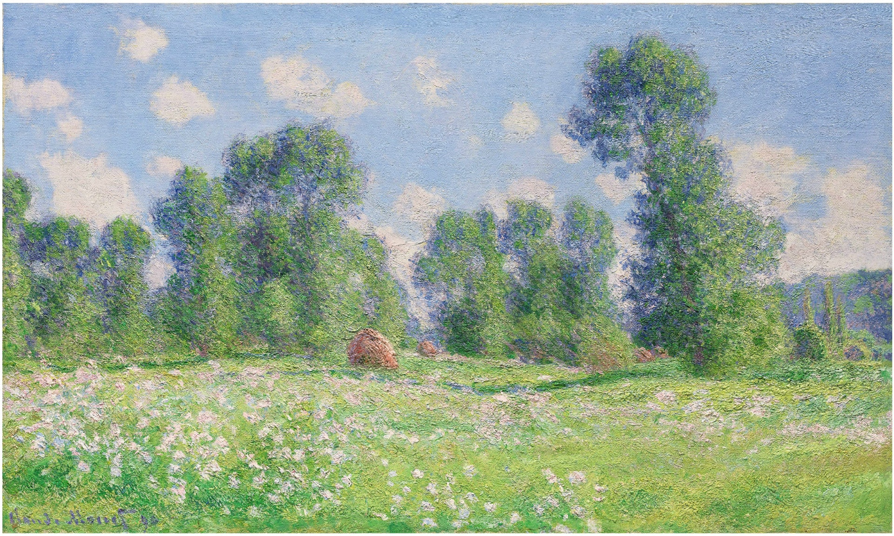

  {width=85% height=85%} 

## Intro

Hi, this is Youlan Shen, a first-year M.S. biostatistics student in Columbia Mailman School of Public Health. If you are interested in learning more about Columbia biostatistics program, you can click on this [link](https://www.mailman.columbia.edu/become-student/departments/biostatistics).

As you reached this website, you can find links about my information on this page.

On the upper right navigation bar, you can find an About Me page, a link to email me, a link to my Github page, and also a link about UCLA Applied Math program (introduction of majors).

This is a direct link to [About Me](about.html). You can find my academic and professional experience on this page.

## Plotly

[Here is](plotly.html) a page about plotly plots with progress. And [another page](Plotly_Dashboard.html) about plotly dashboard.